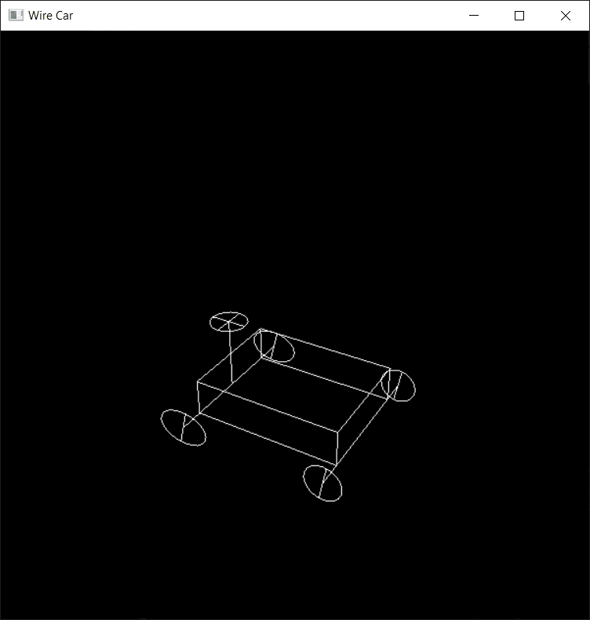
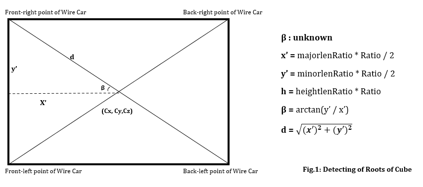
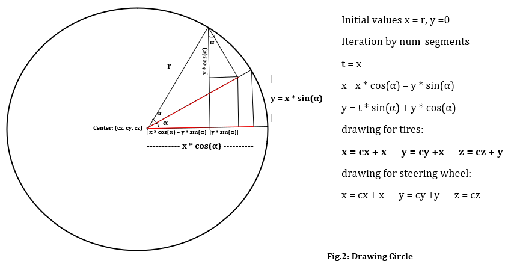

# Wire-Car
Creating an animated wire car using __OpenGL__.
__Wire Car__ is a project that I developed for the __Computer Graphics__ lesson. 

# INTRODUCTION
This code creates a wire car that the user can play with steering and wheel movements. Four Tires, Cube, Axles, Steering Wheel, and Steering Column are required to create the Wire Car. In this code, the __Tires__ function creates four tires, the __DrawCube__ function creates cube, the __SteeringWheel__ function creates the steering wheel and steering column, the __Axles__ function creates axles.

__1-__ The initial situation when the project is started. The tires seem to go forward. Initially, the wire car cannot be moved. 

__2-__ Tires rotate to the left when the __'A'__ key is pressed and to the right when the __'D'__ key is pressed. 

__3-__ The tires stop turning when the __'M'__ key is pressed. Turning the car forward, backward, left or right is left to the user. It can be moved forward by pressing the __'W'__ key, backward by pressing the __'S'__ key, left by pressing the __'A'__ key, and right by pressing the __'D'__ key. 

# Basic ideas that provide a leading role in the development of the code
### Drawing Cube
void DrawCube(double* center, double heightlenRatio, double minorlenRatio, double majorlenRatio, double Ratio)

__Front-right point of Wire Car__ = ( Cx - cos(β) * d, Cy + sin(β) * d , Cz )
__Back-right point of Wire Car__ = ( Cx + cos(β) * d, Cy + sin(β) * d , Cz )
__Front-left point of Wire Car__ = ( Cx - cos(β) * d, Cy - sin(β) * d , Cz )
__Back-left point of Wire Car__ = ( Cx + cos(β) * d, Cy - sin(β) * d , Cz )  

It is enough to raise these four points by h to get the cube.

### Drawing Circle
void Tires(double radius, double num_segments)
void SteeringWheel(double radius , double num_segments)

# When you examine the code, you will ask why
### Why do I calculate "d" to find the vertex points of the cube in figure 1 ? Why don't I just add or subtract x' and y' to the center? [Fig-1](### Drawing Cube)
The wire car is intended to provide forward, backward, left, right turn and movement with keyboard controls. This is basically achieved by forming all the determined points connected to the center. Therefore, the distance of the point to the center is calculated.

### The understanding of why beta defined as 'CubeRotateAngle - 45'
Let us visualize that the x obtained according to the definition of 'x= x * cos(α) – y * sin(α) ' in Figure 2 is added to the x and y coordinates of the center.
The front wheels looked like ellipses when I added the same value to the x and y coordinates of the center of the tires. I managed to fix this error on the rear tires, but when I tried the front wheels, this time I prevented the wheels from turning.
c_b = cosf(beta *PI / 180; s_b = sinf(beta *PI / 180);
I tried this for the front wheels => x = (c_b - s_b) * x + cx;  
                                     y = (c_b - s_b) * x + cy;  
I tried this for the rear wheels =>  x = cos(CubeRotateAngle * PI / 180) * x + cx;  
				                             y =  sin(CubeRotateAngle * PI / 180) * x + cy;  

