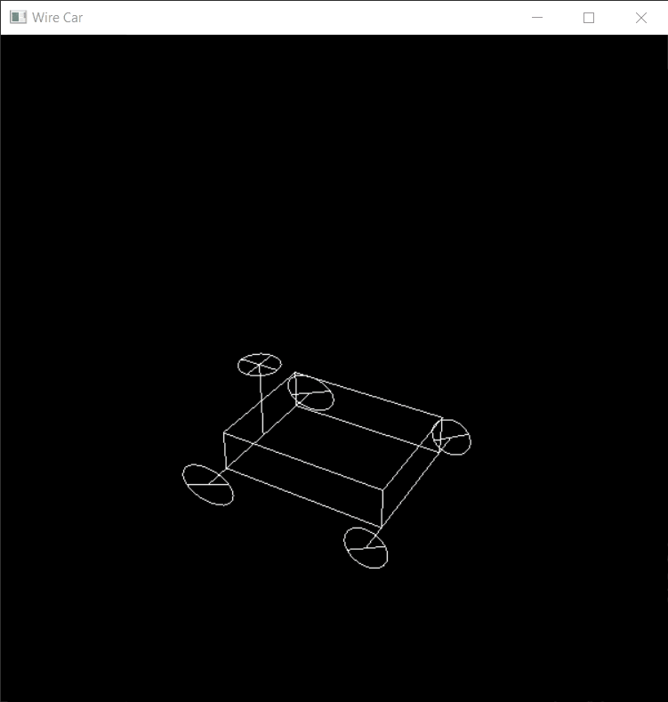

# Wire-Car
Creating an animated wire car using OpenGL.
Wire Car is a project that I developed for the Computer Graphics lesson. 

# INTRODUCTION
This code creates a wire car that the user can play with steering and wheel movements. Four Tires, Cube, Axles, Steering Wheel, and Steering Column are required to create the Wire Car. In this code, the Tires function creates four tires, the DrawCube function creates cube, the SteeringWheel function creates the steering wheel and steering column, the Axles function creates axles.

